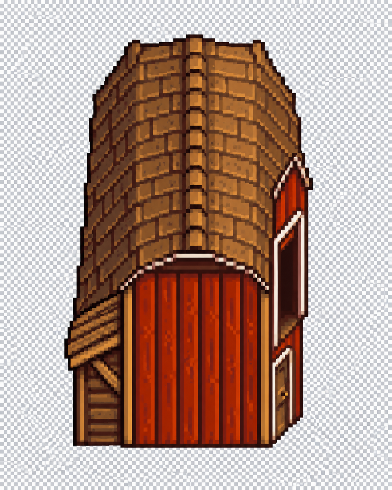
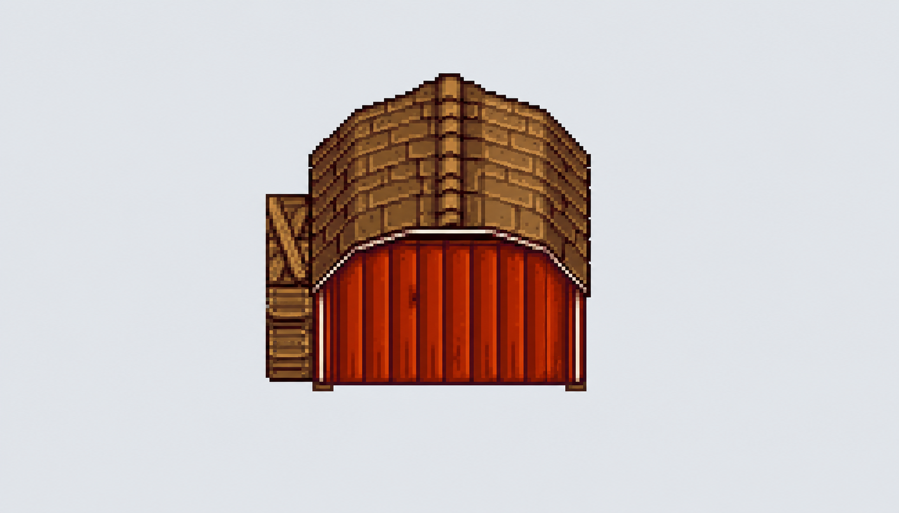
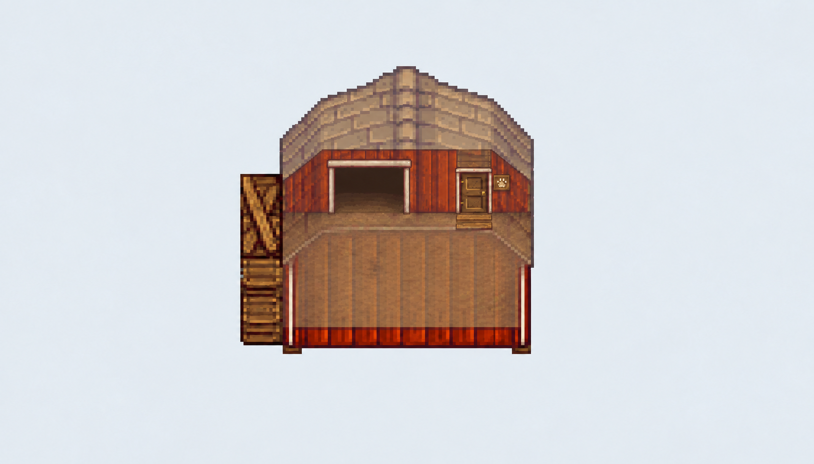

# Barn 美术探索 · 2026-09-09

本轮用内置图像生成工具参照真实 Barn 图集和已验证的地面底稿，生成 5 稿，保留 3 张供后续修订。**目前没有一张通过运行时素材验收。** 这些文件放在文档目录，不进入游戏资源加载。没有新增可安装 mod，也没有改动碰撞或门的计算。

原始 Barn 图集只在本地作为参考，未提交。模型使用其顶部 112×112 主体；下部动物门零件不作为建筑高度。红屋顶 Shed 概念图未混入。完整提示词和输入角色见 [prompts-2026-09-09.json](prompts-2026-09-09.json)，实际文件检查见 [inspection-2026-09-09.json](inspection-2026-09-09.json)。提示词里的画布、坐标和透明度是请求目标，不证明图片已经满足它们，也不修改既有底稿。

## 保留的三张稿

### 朝东侧面 v2

小人物门在右侧较下方，宽动物门在右侧较上方，近处封闭墙面没有额外入口。棕色屋顶、红墙和木构细节可作风格参考。

没有通过的部分：底边与门槛仍有斜透视，无法据此认定 4×7 地面占地对齐；屋脊／山墙关系仍需重画。输出 1122×1402，并非所要求的原生像素尺寸或一致整数倍。两次请求真实透明背景都返回 RGB，图上的棋盘格是画进去的，不能当作透明 PNG 使用。不能通过单纯横向镜像得到经验证的西向入口。

### 朝北普通状态 v1

近处红墙封闭，附属木构移到左侧，保留原牛棚的外观特征。实际入口应在远侧，被屋顶／上墙遮挡。此稿用于讨论普通状态的轮廓，不能用来确认隐藏门的像素锚点。

### 朝北 Reveal v2

屋顶和近处上墙淡化，较低墙脚保持可见；远侧人物门、动物门和附着标识清楚。相较 v1，近处整面实墙造成的“二楼门口”错觉减弱，竖直木板梯也已去掉。

仍需修正：木板出现在门槛下方、建筑内部一侧；北门的外部引导必须位于门槛北侧。画面里的大块棕色平面还可能像可走的院子；它不是获准新增的室外通路或室内地图。门槛位置、投影和遮挡关系均未按原生坐标验收，不能用透明效果替代通行判断。

普通／Reveal 两稿都是 1659×948 的扁平 RGB 合成图，尺寸相同不代表逐像素配准。它们没有独立的屋顶、墙脚、门、标识或地面图层。示意淡化已经烘焙进背景颜色，无法直接乘一次透明度就成为正确的运行时 Reveal。

## 实际检查与未通过项

| 检查 | 实际结果 | 结论 |
| --- | --- | --- |
| 5 张 PNG 完整解码 | 全部可解码 | 文件可读，不代表美术正确 |
| 真正透明背景 | 5 张均为 RGB，无 alpha，也无透明色元数据 | 朝东的透明请求失败；朝北两种状态仅为有背景概念 |
| 仓库内保留图 | 3 张；复制前后字节一致，SHA-256 已记录 | 不含原始游戏 PNG |
| 原生尺寸／地面锚点 | 未达到；没有据图片修改正式锚点 | 不可作为可用素材加载 |
| 分层 | 所有输出均扁平 | 需要真正独立的透明层 |
| 四向覆盖 | 朝东、朝北有新稿；朝南、朝西没有新稿 | 没有完成四向素材套装 |
| 游戏内测试 | 未执行 | 仍缺实际版本及游戏／SMAPI 编译引用 |

旧朝东 v1 和 Reveal v1 不加入仓库图片集；其提示词、输出尺寸和哈希仍在记录中。本轮没有改源码，未重跑无关的 89 项自检；此前通过的结果属于数据／核心提交，本轮只报告图片和文档检查。

## 接着修什么

先把朝北入口和墙脚的地面关系做对，再拆层，随后补齐侧向。继续沿用 [Barn 底稿](../templates/barn-guides.svg) 作为几何依据：

| 当前底稿朝向 | 草稿画布 | 地面原点 | 人物门槛 | 动物门槛 | 门外方向 |
| --- | --- | --- | --- | --- | --- |
| 朝东 | 64×160 | (0,48) | (64,136) | (64,96) | 右 |
| 朝北 | 112×112 | (0,48) | (88,48) | (48,48) | 上 |

这些是 16 源像素／格的局部地面坐标，不是本目录大图上的像素坐标，也不是世界中的传送落点。朝东 v2 提示词尝试的扩画布没有被采用，正式模板保持不变。若需要重构门位，先通过现有按朝向覆盖机制明确新布局，再重新生成底稿；不能只让画面上的门漂移。

下一张需要交付的是按同一画布／原点对齐的地面引导、墙脚、屋顶／上墙、人物门与标识等独立图层，并检查透明像素确实存在。一次尺寸或 alpha 请求失败后，不将同一错误继续复制成全套素材。接入代码可以使用单独标注的开发占位图，但不能把这些概念稿误标为通过验收的游戏资产。用户仍不需要替助手画图。
