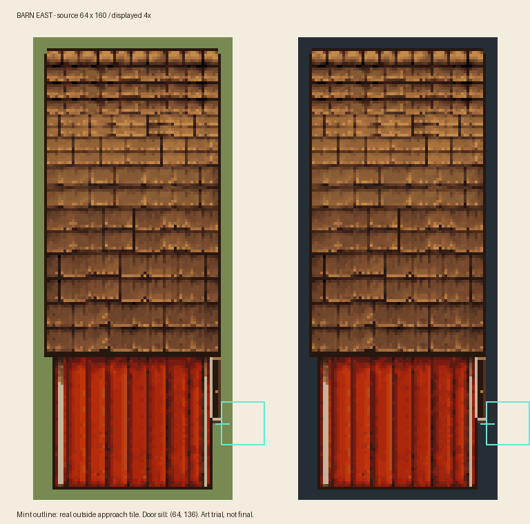

# Barn 朝东游戏比例测试稿

2026-09-17：`barn-east-v1.png` 随实验包 0.1.4 接入拿起预览和日常绘制；尚未收到这一张素材的实机结果。用户已授权程序化裁切、重采样和像素整理。



素材来源为仓库 [Barn v6 四视图](../turnarounds/barn-four-views-v6.png) 的 LEFT 面板，对应游戏 East。按近似相同比例缩小屋瓦与墙材，再重复完整瓦片排和墙段，补像素轮廓与边缘门框。没有直接将整块侧视图拉伸，也未使用提取的原版游戏 PNG。此前带有假棋盘格背景的单张生成结果未采用。

| 对齐项 | 源像素坐标 |
| --- | --- |
| 画布 | 64×160，RGBA；透明度仅 0 或 255 |
| 地面原点 | (0,48) |
| 地面范围 | (0,48)，64×112，对应 4×7 格 |
| 人门阈值 | (64,136)；窄门框下沿贴此位置 |
| 门外接近格 | (64,128)，16×16；位于贴图右侧 |
| 游戏显示 | 源像素放大 4 倍；左上角为建筑原点向上 192 游戏像素 |

程序从 `rotation-template-anchors.json` 核对画布、地面原点与人门阈值，预览青框也读取该文件。这个锚点方案用于试装，不代表概念板已经满足原版投影。屋面偏长、重复纹理和门口偏窄是本稿需要在农场画面里判断的地方。

运行层用 SMAPI 加载贴图，朝东预览显示图像、红绿占地边框及门外青框；放下后显示图像与门外青框。日常建筑沿用底边／SortTileOffset 排序，本稿仍为单层，人物遮挡待实测。其他已接管朝向保留原占位图；没有新增 Reveal、阴影层、动物门动画或皮肤适配。碰撞、门触发、输入和存档逻辑未改。

复现需要 Python 和 Pillow：

```sh
python scripts/build-barn-east-sprite.py
```

输出游戏素材到 `src/BuildingRotation.Smapi/assets/barn-east-v1.png`，本页预览只供检查，不进安装包。两张图与源代码一起保存在仓库；原游戏文件及失败生成图不随包发布。
