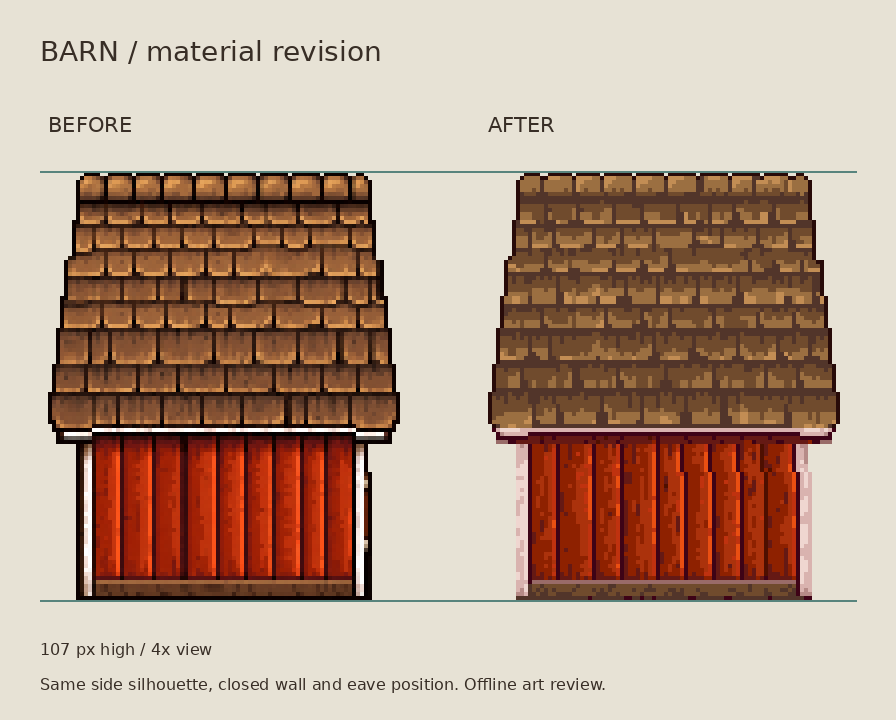
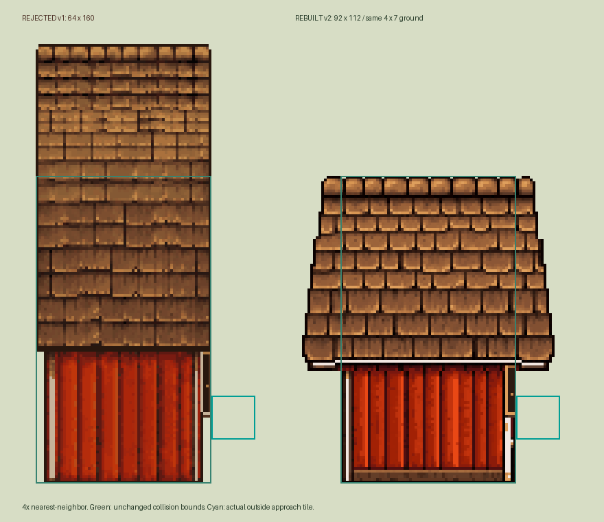
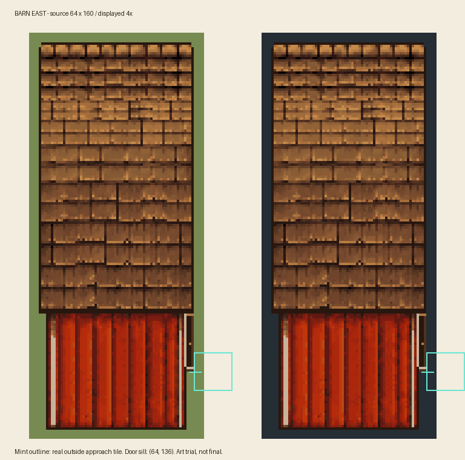

# Barn 朝东素材重做

## 当前：材质修订 v3（2026-09-29，待审）

用户已确认上一张的方向：侧面整墙、与正面同高、宽度可不同。本轮保留该轮廓，修正油亮瓦片、光滑木墙及过白檐边，采用内置 imagegen 重绘后再整理为原生像素；[完整提示词与处理记录](prompts-barn-east-material-v3.json)。



`barn-east-material-v3.png` 为 88×107 RGBA，16 个不透明颜色，alpha 与已确认的高度稿逐字节相同。生成稿屋檐高了 3 像素，整理时将完整屋面、檐边、墙身对回原有分界，不重复瓦片排；再限制调色板、减弱屋面内部黑缝，并清掉零散亮点。檐边改为较柔和的粉米色。无门／窗／门框，墙面保持封闭。

原版正面／上一稿／新稿的同尺度对照已另行交付。新材质仍待用户看图；瓦片排列较规整，不能写成正式美术已验收。本轮未改运行层或出新包，也不重复输入／碰撞／存档测试。

复现：`python scripts/refine-barn-side-materials.py`；可选 `--original-barn /private/Barn.png --private-review /private/comparison.png` 生成含原版的私有对照。

## 已确认方向：完整侧墙与同高对照（2026-09-29）

用户也否决了 v2／0.1.5，并明确本轮要求：**侧面全部为墙，不必露门；拉出共同顶线和地线，宽度可以不同，总高最好一致。**

`barn-east-closed-wall-height-study.png` 从 v2 的完整源图整理：撤回额外窄门框和墙身局部收窄，保留连续墙面；按原版正面主体实际 alpha 边界 `(0,5,112,112)`，将整幅侧面等比缩小至 88×107，正面可见尺寸为 112×107。顶线与地线相距 107 源像素，离线对照统一放大四倍。宽度没有强制相同。

用户确认了墙面／高度方向；这不表示 v2 屋面纹理或整体美术已获接受。运行时仍为历史 0.1.5，未改碰撞／门触发，也没有新安装包。包含原版正面的对照单独交付，不放入公开仓库。

复现对照（原版参考由使用者自行提供）：

```sh
python scripts/review-barn-side-height.py --original-barn /private/Barn.png --review /private/Barn-side-height-alignment.png
```

## 历史：v2 / 安装包 0.1.5（用户已否决）

用户明确否决 v1 的长条屋顶；其美术不再采用。新版用内置 imagegen 完整重画并修订一次，再整理为原生素材。[完整提示词与处理来源](prompts-barn-east-v2.json)记录两次请求。



图中两栋同为四倍源像素显示，绿框是相同的 4×7 占地，青框是相同局部位置的门外格。新图同时有屋檐、侧墙柱和墙脚。完整屋面不再分条重复；生成图按二值 alpha 主体裁切、等比缩小，再单独把墙宽从 78 调整为 64 像素并定位窄门框，最后整理为 64 色。这里明确包含局部墙宽调整，不声称整条流程都保持等比。

| 项目 | v1（拒收） | v2（拒收） |
| --- | --- | --- |
| 原生画布 | 64×160 | 92×112 |
| 地面原点 | (0,48) | (14,0) |
| 地面范围 | 64×112 | 64×112，不变 |
| 人门源图阈值 | (64,136) | (78,88) |
| 扣除原点后的门槛 | (64,88) | (64,88)，不变 |

`barn-east-v2-source.png` 为完整生成稿缩小后的整理源，`scripts/build-barn-east-sprite.py` 从它生成游戏用 PNG 和本页对照；旧脚本保留为 `build-barn-east-sprite-v1.py`。v2 本身为 RGBA，alpha 仅 0/255。原版牛棚和用户人物的同尺度对照已另行交付；那些参考素材不放入公开仓库或 mod 安装包。

0.1.5 预览与日常绘制共用新画布原点，原碰撞、输入、门触发、存档不改。原生尺寸、门槛换算与墙脚边界已检查；离线对照不能代替游戏内人物遮挡检查，用户随后否决了这版外观；不能记为已通过美术验收。其他方向、分层 Reveal 和动物动画继续待办。

## 历史：v1（用户已否决）


2026-09-17：`barn-east-v1.png` 随实验包 0.1.4 接入拿起预览和日常绘制；尚未收到这一张素材的实机结果。用户已授权程序化裁切、重采样和像素整理。



素材来源为仓库 [Barn v6 四视图](../turnarounds/barn-four-views-v6.png) 的 LEFT 面板，对应游戏 East。按近似相同比例缩小屋瓦与墙材，再重复完整瓦片排和墙段，补像素轮廓与边缘门框。没有直接将整块侧视图拉伸，也未使用提取的原版游戏 PNG。此前带有假棋盘格背景的单张生成结果未采用。

| 对齐项 | 源像素坐标 |
| --- | --- |
| 画布 | 64×160，RGBA；透明度仅 0 或 255 |
| 地面原点 | (0,48) |
| 地面范围 | (0,48)，64×112，对应 4×7 格 |
| 人门阈值 | (64,136)；窄门框下沿贴此位置 |
| 门外接近格 | (64,128)，16×16；位于贴图右侧 |
| 游戏显示 | 源像素放大 4 倍；左上角为建筑原点向上 192 游戏像素 |

程序从 `rotation-template-anchors.json` 核对画布、地面原点与人门阈值，预览青框也读取该文件。这个锚点方案用于试装，不代表概念板已经满足原版投影。屋面偏长、重复纹理和门口偏窄是本稿需要在农场画面里判断的地方。

运行层用 SMAPI 加载贴图，朝东预览显示图像、红绿占地边框及门外青框；放下后显示图像与门外青框。日常建筑沿用底边／SortTileOffset 排序，本稿仍为单层，人物遮挡待实测。其他已接管朝向保留原占位图；没有新增 Reveal、阴影层、动物门动画或皮肤适配。碰撞、门触发、输入和存档逻辑未改。

复现需要 Python 和 Pillow：

```sh
python scripts/build-barn-east-sprite.py
```

输出游戏素材到 `src/BuildingRotation.Smapi/assets/barn-east-v1.png`，本页预览只供检查，不进安装包。两张图与源代码一起保存在仓库；原游戏文件及失败生成图不随包发布。
