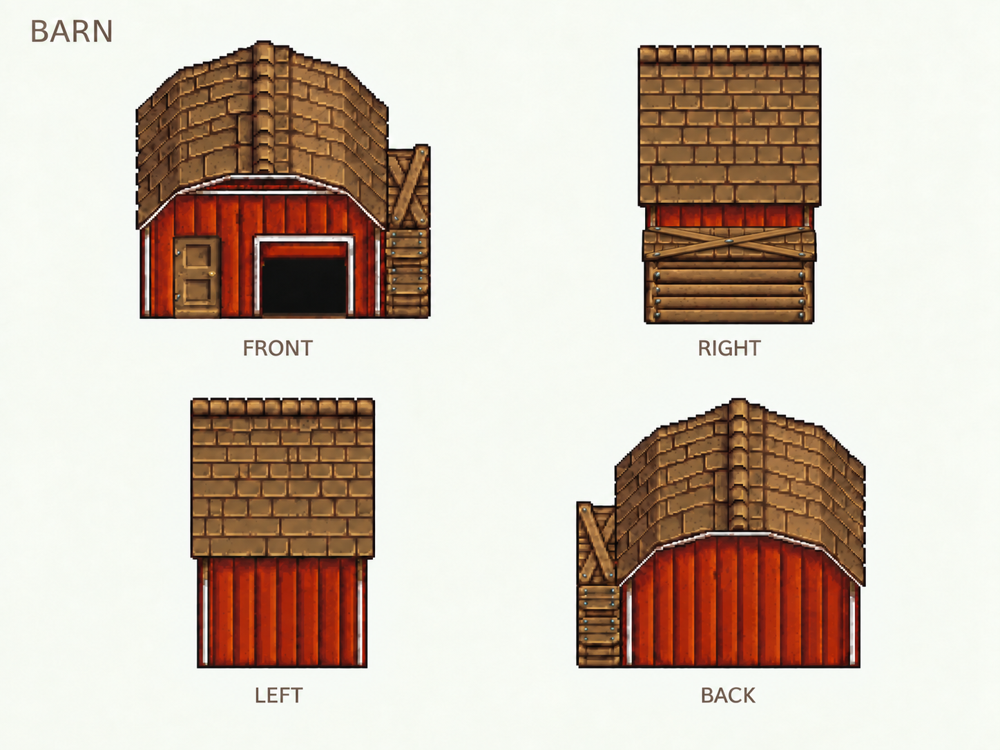
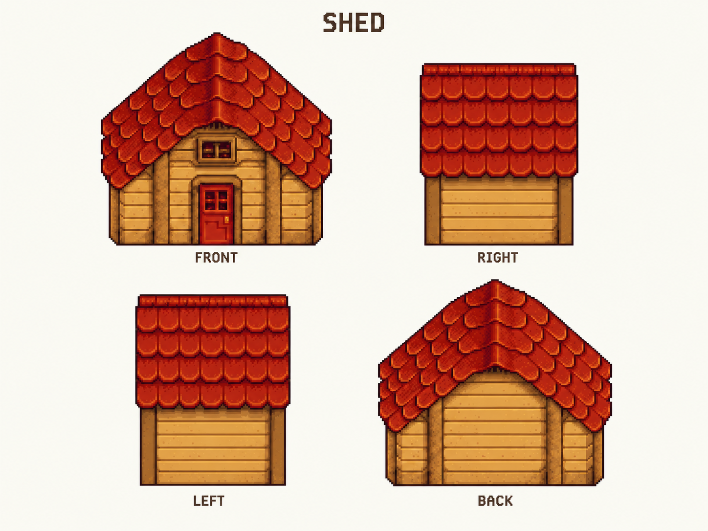
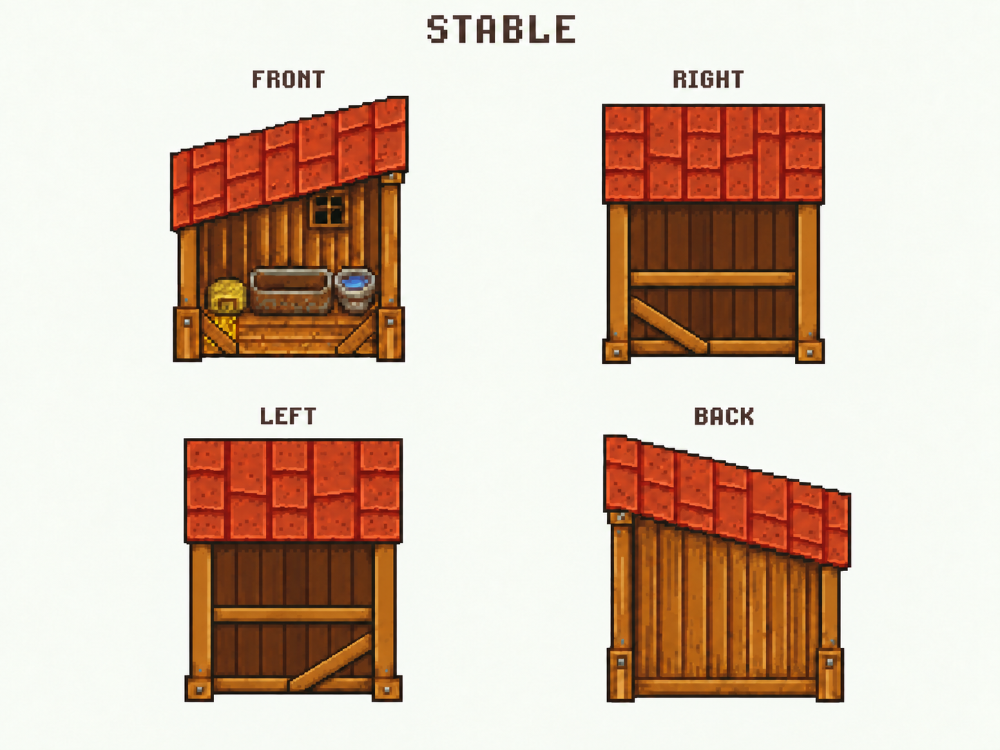

# 三栋建筑四视图 · 待一起看

按用户最新指示，本批先画牛棚、棚屋、马厩的正／左／右／后四个方向，暂缓透明度和 Reveal。用内置图像生成工具制作三套对照板；用户随后开始逐张审阅，先修改 Barn。包括最新侧面宽度反馈共完成 15 次生成／修订，当前三套共 12 个方向；留存 10 张板，含 7 张历史／编辑来源板。**这是待审美术，不是可加载的四向 sprite 套装。**

前一批左右标签反了。按用户指出的建筑左右侧命名，当前 Barn v5、Shed v3、Stable v4 均已统一为：左上 FRONT、右上 RIGHT、左下 LEFT、右下 BACK。面板位置没交换。旧图标签仍有错误，不能混用为当前方向。

美术侧视名称与游戏朝向枚举分开：当前面板的游戏朝向仍是左上 South、右上 West、左下 East、右下 North。纠正文字不修改核心旋转方向或建筑门位。

## 牛棚 Barn



这次侧向改成横向屋脊与屋面，移除了上一批“正面山墙加侧门”的拼接结构。建筑右视图的附属木构位于近端，左视图中它位于远端；背面移到画面左侧。前面已修过附属部分的位置和小屋檐方向。

用户选中 [Barn v3](barn-four-views-v3.png) 并给出三处标注后，v4 直接使用该选中图片编辑：右视图附属木构顶端增加交叉木条，参考 FRONT；互换错误的 LEFT／RIGHT 标签；移除左视图屋脊上方多露出的远侧屋顶条，以右视图干净的顶边为标准。v4 曾完成目视检查，但用户随后指出两根木条的透视仍有问题，因此不能视为投影正确。选中来源与 v3 的 SHA-256 完全一致，未替换编辑来源。

最新 v5 以 [v4](barn-four-views-v4.png) 为来源，把右视图原先立在红墙前的大叉压入附属小棚屋面的浅窄可见范围，恢复其上方的红墙。已查看结果：交叉木条落在小屋面范围内，不再跨过红墙；已修正的左右标签和左侧屋顶轮廓保留。此版仍待用户审阅。生成有细部纹理重绘，不宣称其他区域逐像素不变，也不把目视检查视为严格三维投影验收。

还值得一起看的是屋面的体积感：侧向瓦片仍排列得太整齐，容易像一块竖板，曲面屋顶的明暗转折不够。当前图只建立了比上一批更清晰的方向关系，不代表曲面、比例和细节已经定稿。

## 棚屋 Shed



用户认为 v2 仍太窄，要求侧面试到正面的 2/3。本版以 [v2](shed-four-views-v2.png) 为外观参考，以 [2/3 定宽轮廓](structure/shed-two-thirds-guide-2026-09-09.svg) 控制布局。成图正面外轮廓宽 473 像素，右侧 325、左侧 317，分别约 68.7%／67.0%。保留红橙叠瓦、横木墙、正面红门与阁楼通风口，侧面没有新增正面门或尖顶。

这是按用户要求制作的视觉比例试稿；原有 7×3 占地和碰撞数据没有改变。两侧仍相差 8 像素，屋顶／墙体高度也有生成变化，不能声称只做了逐像素横向扩宽或完整同比例验收。旧 v1、v2 保留。

## 马厩 Stable



用户截图选中的是上一轮较宽的第三次尝试，而非此前提交的窄版 v3。已将该 [用户选定宽版来源](stable-four-views-user-selected-wide.png) 留档，按它的宽度和外观编辑。用户认可的是该图的侧面宽度，不是整栋结构或运行时验收。

v4 的两侧均只留一根抬高的横栏，保留原有斜撑、地面底梁、立柱、水平侧屋檐，以及正面的草、槽和蓝桶。右侧外轮廓 323 像素，与选定来源相同；左侧 318 像素，比来源多 1 像素。正面宽 346 像素。此次不再套用上一轮的 52% 比例。生成有纹理细节重绘，不能承诺未编辑处逐像素相同。

马的可见性、停放和骑乘通路尚未实现，本图没有添加马，也没有改变通行数据。用户随后要求先把现有进度完成，因此水草交互与室内摆放仅记录待讨论。

## 本次检查

| 建筑 | 本轮要求 | 成图检查 |
| --- | --- | --- |
| Stable v4 | 保留截图宽度；每侧只留一根横栏 | 右侧宽度不变，左侧差 1 像素；单横栏、斜撑与底梁保留 |
| Shed v3 | 两侧试到正面 2/3 | 右侧约 68.7%，左侧约 67.0%；仍为待审试稿 |

尺寸从隔离面板内的深色像素外接框量取，含屋檐与柱脚，不含标题。用于检查本轮反馈，不是游戏源像素、碰撞或完整三维模型验收。定宽 SVG 是美术布局目标，不替代正式地面锚点。

## 这次怎样处理侧面老问题

先用 [结构参考脚本](../../../scripts/build-turnaround-reference.py) 建立三个简单体块，再以同一个相机投影四个朝向，最后让图像生成工具参考这些轮廓。

| 建筑 | 结构参考 | 本轮主要方向检查 |
| --- | --- | --- |
| Barn | [四向体块](structure/barn-structure.svg) | 屋脊转为横向；附属木构随建筑到近端、远端或左侧；最终可见范围以用户 v4 修改为准 |
| Shed | [四向体块](structure/shed-structure.svg) | 侧向为屋面和檐墙；不重复正面山墙和入口 |
| Stable | [四向体块](structure/stable-structure.svg) | 保持一个单坡面；侧向不再复制正面的斜屋檐 |

体块是根据正面贴图推定的重构参考。原始资料没有提供官方三维模型；屋高、曲面分段和隐藏结构属于工程／美术估计，不是从 Content 读出的精确事实。参考脚本不读取游戏图片，不生成游戏碰撞，也不替代正式的素材地面锚点。结构参考仍以入口朝向标注 LEFT／RIGHT，不能再把这个工程方向标签当成用户说的建筑左右视图；用户对遮挡和可见范围的具体修订优先。

本轮不强行把原本侧对镜头或被遮住的正门画到可见侧墙上，先解决建筑形体。**这没有撤销游戏中可见门必须对应真实入口的要求。** 基础四向外观确定后，仍需完成侧向入口的视觉重构、背面 Reveal 以及门位对齐。

## 检查记录与后续

当前三张和七张历史／来源留档均为 1448×1086 的 RGB 对照板，已完整解码并检查四个面；左右标签错误及修订状态单独保留，不能用“四个标签存在”代替命名正确。复制文件的 SHA-256 记录在 [inspection-2026-09-09.json](inspection-2026-09-09.json)。本批按用户要求不以 alpha 或 Reveal 作为验收条件。完整请求和修订提示词见 [prompts-2026-09-09.json](prompts-2026-09-09.json)。公开目录没有原版解包 PNG。

三份结构 SVG 可重复生成且字节一致，XML 与画布边界检查通过；屋脊转向、马厩侧向屋檐水平的几何检查通过。参考图已渲染查看。这些检查只证明参考生成与文件完整性，不证明生成图严格服从参考。没有新的游戏内测试；原有 C# 核心和正式素材锚点未改。

当前待审为 Barn v5、Shed v3、Stable v4；本轮单横栏和 2/3 侧宽试稿尚未取得用户定稿确认。透明度、分层、原生分辨率与逐像素门位校准留到形体方向确定后；不再先追着一张 Reveal 图反复调整透明度。

复现结构参考：

```sh
python scripts/build-turnaround-reference.py docs/art/turnarounds/structure
```
