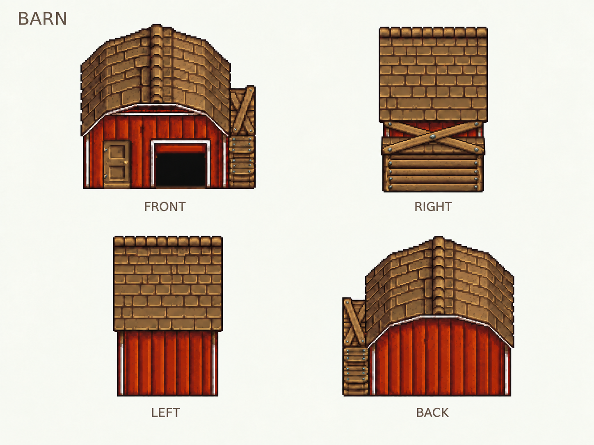
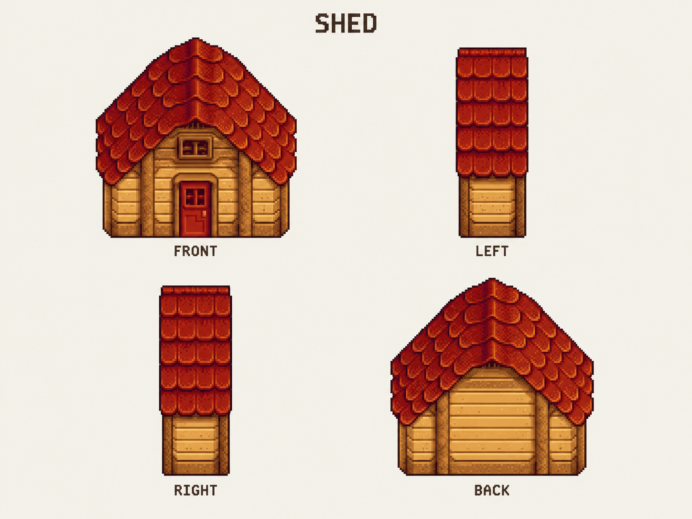
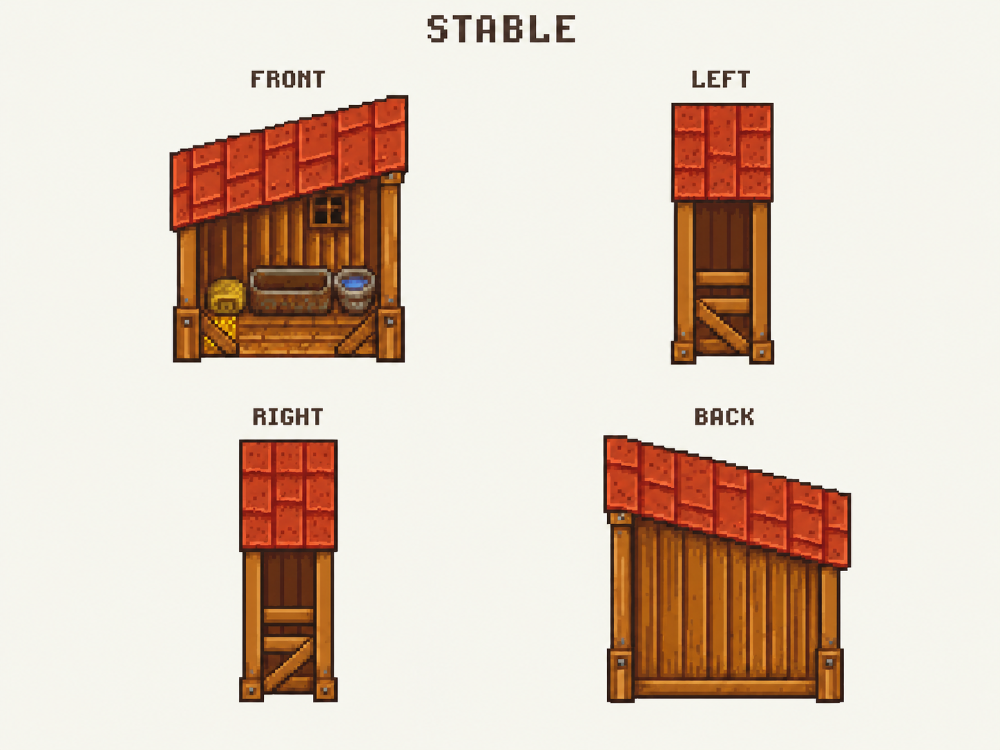

# 三栋建筑四视图 · 待一起看

按用户最新指示，本批先画牛棚、棚屋、马厩的正／左／右／后四个方向，暂缓透明度和 Reveal。用内置图像生成工具制作三套对照板；用户随后开始逐张审阅，先修改 Barn。包括这次反馈共完成 7 次生成／修订，当前三套共 12 个方向，另保留 Barn v3 供对照。**这是待审美术，不是可加载的四向 sprite 套装。**

前一批左右标签反了。用户按建筑本身的左、右侧指出错误，Barn v4 已纠正文字，未移动面板：左上 FRONT、右上 RIGHT、左下 LEFT、右下 BACK。Shed、Stable 仍保留此前板面，标签也尚待各自审阅时修正，不能把它们当作已统一命名。

美术侧视名称与游戏朝向枚举分开：当前面板的游戏朝向仍是左上 South、右上 West、左下 East、右下 North。纠正文字不修改核心旋转方向或建筑门位。

## 牛棚 Barn



这次侧向改成横向屋脊与屋面，移除了上一批“正面山墙加侧门”的拼接结构。建筑右视图的附属木构位于近端，左视图中它位于远端；背面移到画面左侧。前面已修过附属部分的位置和小屋檐方向。

用户选中 [Barn v3](barn-four-views-v3.png) 并给出三处标注后，v4 直接使用该选中图片编辑：右视图附属木构顶端增加交叉木条，参考 FRONT；互换错误的 LEFT／RIGHT 标签；移除左视图屋脊上方多露出的远侧屋顶条，以右视图干净的顶边为标准。三处修改已目视检查，仍待用户继续确认效果。选中来源与 v3 的 SHA-256 完全一致，未替换编辑来源。

还值得一起看的是屋面的体积感：侧向瓦片仍排列得太整齐，容易像一块竖板，曲面屋顶的明暗转折不够。当前图只建立了比上一批更清晰的方向关系，不代表曲面、比例和细节已经定稿。

## 棚屋 Shed



保留红橙瓦顶、原木墙、正面红门和阁楼通风口；侧向没有再重复正面的尖顶和门。背面画成封闭木墙。7×3 占地转向后较窄是预期，但图中四格并没有通过严格的同比例验收。

这栋最适合判断共同视角是否舒服：侧面屋面显得很长、很平，瓦片尺寸和正面的对应关系还需统一。不能只因为门去掉了，就认为侧视图已经成立。

## 马厩 Stable



保留单坡红屋面、木柱、侧栏、正面敞口和背面封闭墙。初稿把正面斜屋檐直接复制到侧面；修订后，侧向屋面的上下沿改为水平，让坡度沿画面深度变化。正背面屋顶的高低方向相反。

左右屋面的显露长度、柱高及透视还需要对照统一；目前差异没有完全贴合结构参考。正面低处的木板／斜撑也可能让中央入口显得被挡住，后续落到素材时要明确是地板还是栏杆。没有因此修改原本 `XXXX/XOOX` 的通行数据。

## 这次怎样处理侧面老问题

先用 [结构参考脚本](../../../scripts/build-turnaround-reference.py) 建立三个简单体块，再以同一个相机投影四个朝向，最后让图像生成工具参考这些轮廓。

| 建筑 | 结构参考 | 本轮主要方向检查 |
| --- | --- | --- |
| Barn | [四向体块](structure/barn-structure.svg) | 屋脊转为横向；附属木构随建筑到近端、远端或左侧；最终可见范围以用户 v4 修改为准 |
| Shed | [四向体块](structure/shed-structure.svg) | 侧向为屋面和檐墙；不重复正面山墙和入口 |
| Stable | [四向体块](structure/stable-structure.svg) | 保持一个单坡面；侧向不再复制正面的斜屋檐 |

体块是根据正面贴图推定的重构参考。原始资料没有提供官方三维模型；屋高、曲面分段和隐藏结构属于工程／美术估计，不是从 Content 读出的精确事实。参考脚本不读取游戏图片，不生成游戏碰撞，也不替代正式的素材地面锚点。结构参考仍以入口朝向标注 LEFT／RIGHT，不能再把这个工程方向标签当成用户说的建筑左右视图；用户对遮挡和可见范围的具体修订优先。

本轮不强行把原本侧对镜头或被遮住的正门画到可见侧墙上，先解决建筑形体。**这没有撤销游戏中可见门必须对应真实入口的要求。** 基础四向外观确定后，仍需完成侧向入口的视觉重构、背面 Reveal 以及门位对齐。

## 检查记录与后续

当前三张和留档的 Barn v3 均为 1448×1086 的 RGB 对照板，已完整解码并检查四个面；左右标签错误及修订状态单独保留，不能用“四个标签存在”代替命名正确。复制文件的 SHA-256 记录在 [inspection-2026-09-09.json](inspection-2026-09-09.json)。本批按用户要求不以 alpha 或 Reveal 作为验收条件。完整请求和修订提示词见 [prompts-2026-09-09.json](prompts-2026-09-09.json)。公开目录没有原版解包 PNG。

三份结构 SVG 可重复生成且字节一致，XML 与画布边界检查通过；屋脊转向、马厩侧向屋檐水平的几何检查通过。参考图已渲染查看。这些检查只证明参考生成与文件完整性，不证明生成图严格服从参考。没有新的游戏内测试；原有 C# 核心和正式素材锚点未改。

用户已开始逐张看，当前先看 Barn v4；Shed、Stable 保留现稿，等各自的反馈再改。透明度、分层、原生分辨率与逐像素门位校准留到形体方向确定后；不再先追着一张 Reveal 图反复调整透明度。

复现结构参考：

```sh
python scripts/build-turnaround-reference.py docs/art/turnarounds/structure
```
