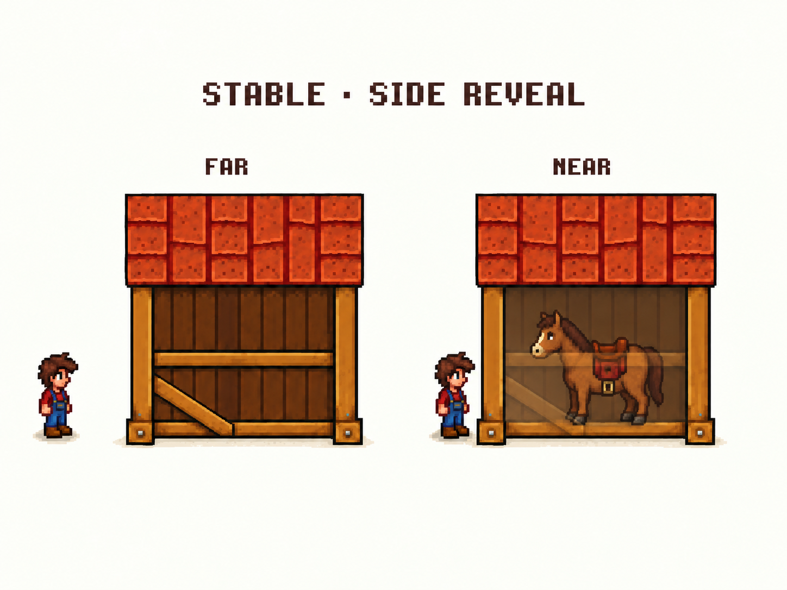

# 马厩侧面靠近显露：首次对照

2026-09-10；待审概念稿，非游戏截图或可直接使用的分层素材。



基于 Stable v4 的 RIGHT 视图，保留选定宽度、单横栏、斜撑与水平屋檐。本轮用内置 imagegen 生成后针对马的可辨认性和玩家远近差修订一次，保存第二张。原 Stable v4 四视图不变。

远处保持建筑遮挡；靠近时淡化近侧遮挡，让马显露，保留屋顶、立柱和底座。马与玩家尺寸、停放点及距离仅为示意，未使用真实角色 sprite 校准，也不代表点击、骑乘或通行验证。远处的马完全被遮住，单张静态图不能证明隐藏角色的实际位置。

复核：马的脸、鞍、腿已可辨认；第二稿减少了墙板穿过马身的痕迹，远近玩家距离差更明显。横栏经过马身仍有明显棕色覆盖，正式实现需用独立图层保留马自身颜色；生成图也有细节重画，不能认定精确保持了原像素。本轮不继续为此反复出图。

另一侧、无马状态和 Shed 室内方向对照已在[本轮使用示意](../use-studies/README.md)补齐，待审阅。详细设计边界仍见[室内与马厩方案](../../interior-and-stable-plan.md)。用户明确允许设计讨论充分展开；精简的是重复读取、重复记录及无关验证，不删去需要讨论的方案与边界。

## 生成提示词

工具：内置 imagegen，未使用 CLI。

首次生成：

```text
Use case: precise-object-edit.
Asset type: Stardew Valley mod art review mockup, NOT a precise engineering diagram or production sprite.
Input image: edit target stable-four-views-v4.png. Use ONLY the TOP RIGHT building labeled RIGHT, preserving its chosen wide shape, rectangular orange tiled roof with horizontal eaves, two end posts, ONE elevated horizontal rail, diagonal brace descending left to right, and bottom foundation beam. Do not use or redraw other building views.
Create a clean two-panel side-by-side comparison on warm off-white background, same stable camera, size, position relative to ground, and pixel-art rendering in both panels. Title "STABLE · SIDE REVEAL"; left panel label "FAR", right "NEAR". No other text.
Place the same small brown saddled horse INSIDE the stable in both panels, standing on the floor, in side profile facing image left. Horse fits naturally below eave and inside posts, sized relative to a Stardew-style player (horse back around chest height of player). Keep horse in EXACT same position in both states; its obscuration changes, not its position. A small player sprite stands on exterior ground toward the left: farther from stable in FAR, close to the left entrance end but still outside in NEAR. Keep enough canvas margin for player.
FAR: preserve opaque v4 architecture. The near side timber wall and rail naturally conceal most or all of horse. Do not paste horse on top of opaque wall.
NEAR: selectively reveal horse by making obstructing NEAR wooden wall planks, horizontal rail and diagonal brace translucent ghost layers, retaining their shapes and colors faintly. Horse itself stays fully opaque and clearly readable BEHIND faded layers, all four hooves on stable floor. Preserve opaque main roof unless it actually covers horse; retain strong end posts, foundation beam and floor. Do NOT fade horse, player, ground, or entire building together. Do NOT delete architecture or turn into cutaway with missing parts. No new windows, extra rails, changed width, new door, rotated camera, perspective skew, checkerboard texture, arrows, grid, coordinate labels or numerical opacity. This is a perceptual near/far concept; consistent architecture and convincingly selective transparency matter most.
```

定向修订（本页保存图）：

```text
Use case: precise-object-edit. Edit the provided STABLE SIDE REVEAL two-panel mockup. Keep layout, titles, BOTH stable silhouettes, roof colors and shape, single horizontal rail, diagonal brace, pillars and foundation EXACTLY unchanged.
Correct ONLY these two problems:
1. In NEAR, the horse must be solid, fully opaque brown with crisp dark outline, saturated red-brown saddle, bright cream muzzle, dark mane and legs. It is not a ghost. The obstructing NEAR SIDE wall is almost clear with only extremely faint traces of planks; horse is behind this nearly transparent wall. No visible wall plank lines should cross horse body. The rail/brace are faint translucent foreground shapes, but the horse behind them remains vividly readable. Retain structural posts, base and roof opaque. Avoid washing all horse colors into brown wall. Empty space surrounding horse can show a subtle floor and soft interior shade. Same horse pose, position and size.
2. In FAR only, move player farther left so the gap between player's right edge and stable's left edge is about twice player's width; achieve by modestly reducing BOTH paired stable scenes uniformly if needed to fit margins. NEAR player stays beside stable.
FAR horse stays concealed by original opaque architecture. Do not change building design, do not add rails, doors or windows. No new text or arrows. Pixel art game mockup, warm off-white ground.
```
