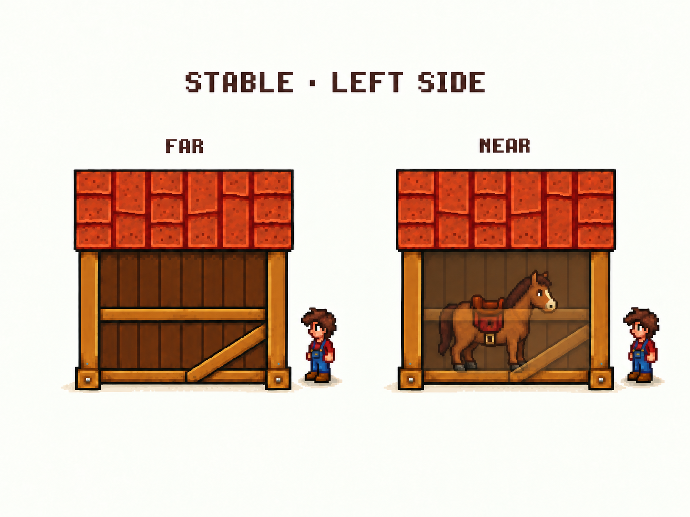
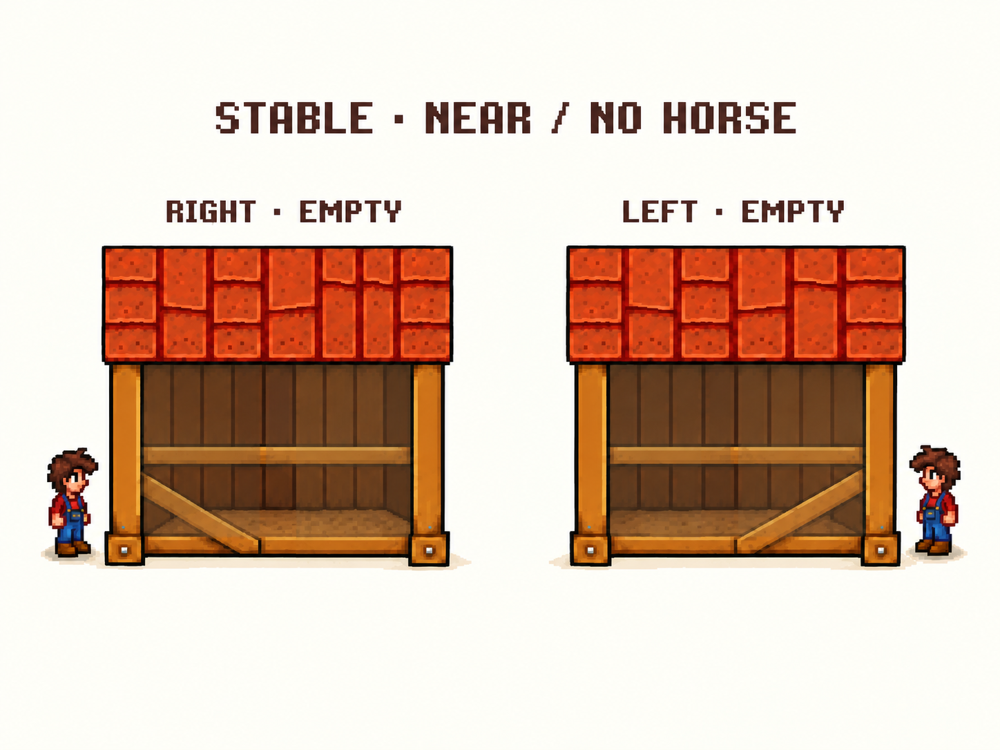
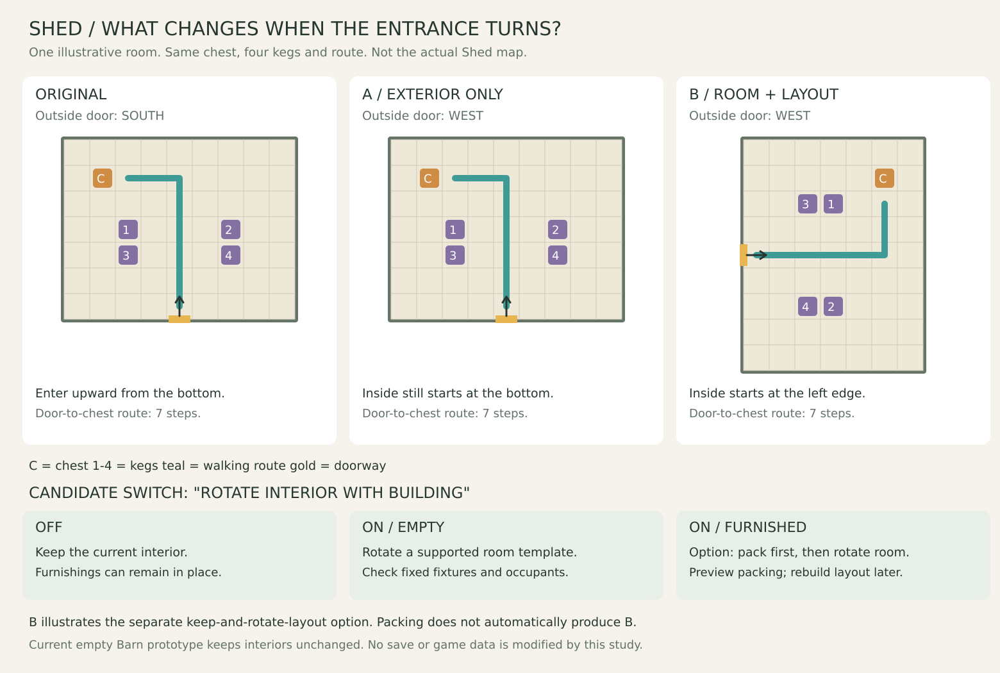

# 马厩使用状态与 Shed 室内方向对照

2026-09-10，本轮示意制作完成，待用户审阅。没有修改游戏代码、存档或正式建筑素材；尚未实机验证。

## 马厩：另一侧与空马厩

[已有 RIGHT 侧远近对照](../turnarounds/stable-side-reveal.md)。以下新图延续 Stable v4 选定宽度、单横栏、左右不同的斜撑。





另一侧的马朝画面右边，接近位置也放在右边；无马图保持近侧结构淡化，目的是让玩家确认停放处为空，而不是因没有马就关闭 Reveal。屋顶、主柱与地基继续保留。马与人的比例、停放点、入口接近方向都是草案，不能当作实际交互坐标。

复核保留的问题：LEFT 远近两个人物的实际距离差几乎没画出来，因此 FAR／NEAR 只能读作状态标签，不可作为距离设定依据；马身经过栏杆的位置仍偏灰。无马图比有马图露出了更多地面深度，说明生成发生了重画，尚不是同一份素材仅切换角色显示。两侧的单横栏和斜撑方向符合参考，但未进行原生像素尺寸校准。本轮保留这些明确缺口供审阅，不继续无限修图，也不宣称像素结构锁定。

## Shed：外部转向后，室内怎么衔接



[可编辑矢量图](shed-interior-options.svg)。图从左到右是原始状态、A 只转外部、B 房间与摆放整体转向。图中的房间为说明问题而设定的 9×7 格，不是解包得到的 Shed 室内地图，也不改变外部 7×3 占地定义。

橙色 C 是同一个箱子，紫色 1—4 是同四个酒桶，金色是门，青色是取箱子的行走路线。原入口在南边，外部顺时针转向西边后：A 室内仍从下方往上走；B 室内改为从左边往右走，房间长短边、门、箱子、酒桶和路线一起转过来。物件标记保持正着，便于比较，不代表机器的绘制朝向已经适配。

这个例子中，门槛格到箱子相邻操作格都是 7 步，物件数量、门与摆放的相对关系不变。它说明“整体转向”可以保留布局关系；屏幕上的按键方向仍会改变。没有证明所有家具、固定设施或 mod 物件都能同样处理。

**B 是保留摆放一起转的候选路线；自动打包是另一条路线。** 打包后转房间不会自动得到图 B，玩家还需要重新摆放。两者需要按用户更在意“省去逐个收取”还是“保留已摆好的房间”来取舍，尚未定案。

## 空房／有物品时的候选流程

下面是把用户提议落成可讨论的行为，不表示开关默认值、强制清空规则或箱子经济已经确认。

| 当前状态／选择 | 操作过程 | 结果与可退出处 |
| --- | --- | --- |
| 室内跟随关闭 | 外部旋转，保留当前室内 | 有摆放也不要求清空；室内不静默重置 |
| 跟随开启，当前为空 | 检查支持的房间模板、固定设施和角色位置，再转房间及门 | 不通过则维持原状；“原本为空”和“后来清空”同样处理 |
| 跟随开启，当前有物品，选择打包 | 清点及状态检查 → 展示物品与所需箱数／可达放置处 → 玩家确认 → 打包并转房间 | 确认前可取消；成功后东西在箱中，需重摆；箱数与赠送规则待定 |
| 当前有物品，希望保留布局 | 研究图 B 的整套摆放转向 | 不自动转成打包；适配对象和固定设施后才可开放 |
| 打包发现无法保留的状态，或容器无可达位置 | 执行前指出具体原因 | 不先收一半；玩家可取消或处理该对象后再试 |

物品内容、机器加工状态与失败回退等边界继续保留在[设计讨论](../../interior-and-stable-plan.md)。用户允许充分展开设计风险；本轮只精简重复记录和无关检查。

## 本轮完成情况与下一步

左右侧有马的远近示意、左右侧无马的靠近示意，以及 Shed 三状态和候选操作流程均已备齐。它们属于待审视觉／设计材料，不是四向骑乘测试；马厩 FRONT／BACK 带马使用图和精确进出通路也尚未制作。原 Barn v5、Stable v4、Shed v3 四视图保持原样。

下一步共同审阅马厩显露是否足够、Shed 选择外部单转／保留布局整体转／打包后转哪条路线；尚无必须当场决定的参数。工程首个可玩目标仍是普通空牛棚；拿到游戏、SMAPI、搬动 mod 的版本及程序集后接入，不以这轮室内方案全部定案为前提。

## 生成记录

马厩两张新图使用内置 imagegen，各生成一次，无 CLI。Shed 图以代码生成 SVG 并渲染 PNG，以保证物件和路径对应；已检查对象数量、路径连续和路径不穿物件，并目视检查排版。

LEFT 提示词：

```text
Use case: precise-object-edit.
Create the OPPOSITE SIDE version of the supplied STABLE SIDE REVEAL comparison. Reference 1 is the structural authority: stable-four-views-v4.png, ONLY its BOTTOM LEFT building labeled LEFT. Reference 2 is the compositional and reveal-style reference.
Two panels FAR and NEAR on cream background, title "STABLE · LEFT SIDE". Match the reference 2 pixel art, scene scale, player/horse sizes, red tile rectangular roof with horizontal eaves. Preserve the LEFT-view single elevated horizontal rail, diagonal brace rising from bottom center-left toward RIGHT post, thick end posts and bottom beam; keep chosen wide shape. Do not copy the descending brace of the RIGHT view.
Horse INSIDE faces RIGHT toward entrance end, same position in both states. Player is on exterior ground to RIGHT of stable, farther away in FAR, just outside in NEAR. Allow sufficient margins. FAR architecture is opaque and conceals horse. NEAR fades only obstructing near wood planks, rail and diagonal brace; horse is vivid fully opaque with crisp brown coat, dark mane, cream muzzle, red saddle and hooves on the floor. Keep roof, end posts and foundation opaque. Retain faint foreground rail and brace instead of removing them. Do not paint ghost horse, do not put horse outside, no new gates or extra rails, no perspective change. Two states have same architecture. Review mockup only, no grid, arrows or numerical annotations.
```

无马状态提示词：

```text
Use case: precise-object-edit.
Create a companion EMPTY-STABLE NEARBY comparison using two supplied images as edit targets. Reference 1 contains RIGHT-side architecture; Reference 2 contains LEFT-side architecture. Keep the NEAR panel building from each, with identical scale and style. Output two panels: left label "RIGHT · EMPTY", right label "LEFT · EMPTY". Title "STABLE · NEAR / NO HORSE". Warm cream background, pixel-art mockup.
Remove ONLY the horses from both revealed interiors, reconstruct visible interior ground and depth without horses. Players remain close on the exterior entry ends: to LEFT of the RIGHT-view stable, to RIGHT of the LEFT-view stable.
Keep proximity reveal ACTIVE even though horse is absent: near-side wall, the ONE elevated horizontal rail and diagonal brace remain faintly translucent. Preserve roof, main posts and foundation fully opaque. Make it visibly possible to inspect unoccupied standing space behind the near-side faded structure. Do not replace the revealed space with an opaque near-side plank wall; any remaining darker wall is the farther wall behind standing space. Do not delete rail or diagonal brace. RIGHT brace descends left-to-right; LEFT brace ascends left-to-right. Same wide shapes, horizontal eaves, orange roofs, no added equipment or horses or silhouettes. Do not turn off reveal merely because empty. No arrows or grid or numerical opacity.
This is an appearance concept, not exact game geometry.
```
